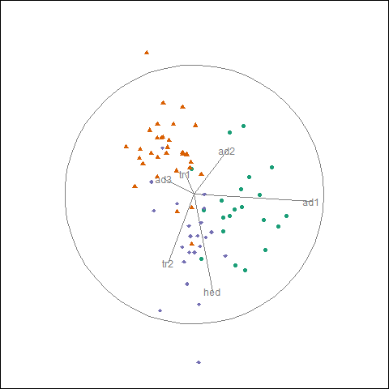
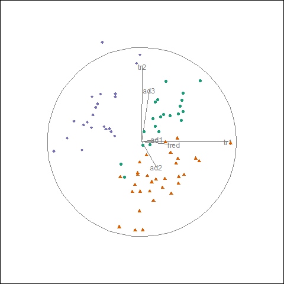
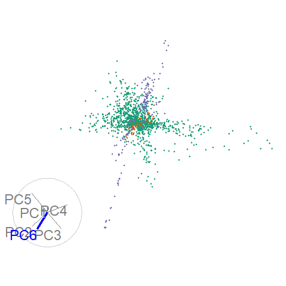

```{r setup_pres, include=FALSE}
knitr::opts_chunk$set(
  eval      = TRUE,  # R code 
  echo      = FALSE, # code text
  include   = TRUE,  # plots
  results   = 'asis', # text 'markup' 'asis' 'hold' 'hide'
  message   = F, warning = F, error = F, cache = T, cache.lazy = T,
  collapse  = TRUE,
  fig.align = "center"
)

library(spinifex)
library(gganimate) 
library(ggplot2)
library(magrittr)
library(knitr)
library(kableExtra)

## FUNCTION FOR STATIC OUTPPUT, for chap3 use to clean up code chunks.
array2static_sub <- function(.m_tour, .data, .m_var, .cat, .mag =2.2, .sub=3)
{
  slides       <- array2df(array = .m_tour, data = .data)
  basis_slides <- slides$basis_slides
  data_slides  <- slides$data_slides
  basis_slides <- dplyr::filter(basis_slides, slide %in% 1:.sub)
  data_slides  <- dplyr::filter(data_slides, slide %in% 1:.sub)
  n_slides     <- max(basis_slides$slide)
  
  # Initialize
  ## manip var asethetics
  p             <- nrow(basis_slides) / n_slides
  col_v         <- rep("grey80", p)
  col_v[.m_var] <- "blue"
  col_v         <- rep(col_v, n_slides)
  siz_v         <- rep(0.3, p)
  siz_v[.m_var] <- 1
  siz_v         <- rep(siz_v, n_slides)
  cat           <- rep(as.factor(.cat), n_slides)
  
  ## circle
  angle <- seq(0, 2 * pi, length = 180)
  circ  <- data.frame(c_x = cos(angle), c_y = sin(angle))
  circ[nrow(circ)+1, ] <- NA
  ## data asethetics
  data_slides <- data.frame(data_slides, cat = rep(.cat, n_slides))
  
  grid_b <- grid_t <-
    data.frame(slide = 1:n_slides, 
               x = .mag*rep(1:.sub), y = .mag*rep(1, each = 3))
  grid_t$y <- grid_t$y + max(grid_t$y)
  # OUTER JOIN
  basis_grid <- merge(x = basis_slides, y = grid_t, by = "slide", all = TRUE)
  # CROSS JOIN
  circ_grid  <- merge(x = circ, y = grid_t, by = NULL)
  # OUTER JOIN
  data_grid  <- merge(x = data_slides, y = grid_b, by = "slide", all = TRUE)
  
  # BASIS
  gg1 <-
    ggplot(data = basis_grid) +
    # AXES LINE SEGMETNS
    geom_segment(aes(x = V1 + x, y = V2 + y, xend = x, yend = y),
                 color = col_v, size = siz_v) +
    # AXES TEXT LABELS
    geom_text(aes(x = V1 + x, y = V2 + y, label = lab_abbr),
              color = col_v, vjust = "outward", hjust = "outward") +
    # AXES FRAME NUM
    geom_text(aes(x = x - .7, y = y + 1.1, 
                  label = paste0("frame: ",slide)), color = "grey50") +
    # AXES CIRCLE PATH
    suppressWarnings( # Suppress for "Removed 1 rows containing missing values."
      geom_path(data = circ_grid, color = "grey80",
                mapping = aes(x = x+c_x, y = y+c_y))
    )
  
  # PROJECTION
  gg2 <- gg1 +
    # PROJ DATA POINTS
    geom_point(data = data_grid, size = .7,
               mapping = aes(x = V1 + x, y = V2 + y, color = cat),
               shape = as.integer(cat) + 15) +
    # PROJ DATA FRAME NUM
    geom_text(data = data_grid, color = "grey50",
              mapping = aes(x = x - .7, y = y + 1.1, 
                            label = paste0("frame: ",slide))) +
    theme_void() +
    scale_color_brewer(palette = "Dark2") + 
    coord_fixed() +
    theme(legend.position="none")
  
  gg2
}
```

# Motivation

Exploratory data analysis is important and ubiquitous, and it's important to keep visual interpretation: 


Datasaurus dozen; same means, standard deviations, and correlations, *Matejka & Fitzmaurice, 2017*

---

# Visualizing multivariate spaces

- Visualization becomes complex; use dimension reduction
- One static projection doesn't portray all of the variation
- Dynamic rotations do a better job of revealing the structure

**Shadow puppet analogy (linear projection from 3- to 2D):**


---

# Dynamic linear projections, tours   

**Available on CRAN,** `tourr` R package, *Wickham et al. 2011*

- Random choice - *grand tour* random forest walk in $p$-space *Asimov 1985*
- Data-driven - *guided tour* projection pursuit, optimize an objective function on the projection *Hurley & Buja 1990*

--

.pull-left[
grand tour (random):
```{r, echo=F, out.height= '70%', out.width='70%'}

```
]

--

.pull-right[
guided tour - optimizing holes index:
```{r, echo=F, out.height= '70%', out.width='70%'}

```
]

---

# Research objectives

- 1) How can user-controlled steering (UCS) be generalized to work within graphic-specific environments for 2D projections?
- 2) Does 2D UCS tours provide benefits over alternatives?
- 3) How do we extend UCS to 3D?
- 4) Does UCS in 3D displays provide benefits over 2D displays?

---

# RO 1) How can UCS be generalized to work within graphic-specific environments for 2D projections?

- Manual choice - *manual tour* user-controlled manipulation of a selected variable *Cook & Buja 1997*
    - Used to explore the sensitivty of the structure to the variables contributing to the porjection
    
*Algorithm design, work in progress & paper to be submitted to the R Journal:*
- Algorithm generalising for consumption by graphic envirnments
- R implementation via the package `spinifex`, available on [github.com/nspyrison/spinifex](https://github.com/nspyrison/spinifex)
    `devtools::install_github("nspyrison/spinifex")`
    - manual tours in R, extending the `tourr` package
    - platform to pass tours to animation-specific envirnoments
- application to contemporary high erergy physics

---

# Step 1) Choose a variable of interest

- Starting with the last projection of the previous holes-indexed guided tour:

```{r setup, results='hide'}
f_dat  <- tourr::rescale(flea[,1:6])
f_cat  <- factor(flea$species)
f_path <- save_history(f_dat, guided_tour(holes()))
f_bas  <- matrix(f_path[,, max(dim(f_path)[3])], ncol=2)
f_mvar <- 5
f_proj <- data.frame(tourr::rescale(f_dat %*% f_bas))
```

.pull-left[
```{r, fig.height=6, fig.width=12, out.height='130%', out.width='130%'}
view_basis(f_bas, labels = colnames(f_dat)) +
  geom_point(data = f_proj, 
             mapping = aes(x = X1 - 2, y = X2 - .5, color = f_cat), 
             pch = as.integer(f_cat) + 15)
```
]

.pull-right[
```{r}
rownames(f_bas) <- colnames(f_dat)
colnames(f_bas) <- c("x", "y")

f_bas %>% kable() %>% kable_styling()
```
]

- Choose a manipulation variable: `aede2`

---

# Step 2) Create a manipulation space

.pull-left[
```{r, out.height='80%', out.width='80%'}
view_manip_space(basis = f_bas, manip_var = f_mvar, labels = colnames(f_dat))
```
]

.pull-right[
<br><br>
- Orthonormaliaze a dimension with a full contribution to the manipution variable
- This provides a means to rotate the basis out of the projection plane (for example, lifting paper off of the table rather than being confined to the surface)
- Create a sequence of values for the 'out-of-plane' angle that will change the projection coeffienients of the variable
]

---

# Step 3) Genrate the rotation

*Over the sequence of angles:* rotate the manipulation space for each element.

- Project the data
- Plot the first two variables of rotated basis and projection

```{r, fig.hight=2, out.width='45%', out.height='45%'}
f_ang <- .35
f_mt <- manual_tour(basis = f_bas,manip_var = f_mvar,angle = f_ang)

array2static_sub(.m_tour = f_mt, .data = f_dat,
                 .m_var = f_mvar, .cat = f_cat)

### Leaves white space across t+b, alternatively can use screenshot:
#
```

---

# Display as an animation

- `aede2` is important for distinguishing between the green and purple clusters

```{r, results='hide'}
library(spinifex)
f_ang  <- .08
f_proj <- data.frame(tourr::rescale(f_dat %*% f_bas))

### GGANIMATE
f_mt <- play_manual_tour(data = f_dat, basis = f_bas, manip_var = f_mvar,
                         angle = f_ang, cat_var = f_cat,
                         render_type = render_gganimate) + coord_fixed()

gganimate::anim_save(filename = "./images/f_mt.gif", animation = f_mt,
                     start_pause = 15, width = 480, height = 480, res = 150)
```
```{r, out.width='40%', out.height='40%'}
knitr::include_graphics("./images/f_mt.gif")
```

As an [html widget](https://nspyrison.netlify.com/thesis/flea_manualtour_mvar5/)


---

# Application -- high erergy physics

Hadronic collision experiment data, $\textbf{X} \in \mathbb{R}^{56}$, *Wang, et al. 2018*, studied with guided tours *Cook, et al. 2018*

.pull-left[
```{r, results='hide'}
##DIS cluster, fig 8 of cook_dynamical_2018
load("./data/grDIScenter.rda")
load("./data/DIScluster_centered_basis.rda")
DIS_bas  <- DIScluster_centered_basis
DIS_dat  <- tourr::rescale(grDIScenter[, 1:6])
DIS_cat  <- factor(grDIScenter$disID)
DIS_mvar <- 6
DIS_ang  <- .15

### GGANIMATE

DIS_mt <- play_manual_tour(data = DIS_dat, basis = DIS_bas, manip_var = DIS_mvar,
                           angle = DIS_ang, axes="bottomleft", cat_var = DIS_cat,
                           render_type = render_gganimate)

gganimate::anim_save(filename = "./images/DIS_mt.gif", animation = DIS_mt,
                     start_pause = 15, width = 480, height = 480, res = 150)
```
```{r, out.width='80%', out.height='80%'}

```

As an [html widget](https://nspyrison.netlify.com/thesis/discluster_manualtour_pc6/), UCS on each of the 6 components
]

.pull-right[
Given:
- Data summarized in 6 principal components, ~48% of the variation
- Starting basis from previously published figures

Conclusion, PC6 is important for explaing structure features in the data:
- When the contribution of PC6 is full, the plane of green points extends into the line of sight
- When the contribution is zeroed, the line of purple points are approaching a head-on view
]


---

# RO 2) What benefits does UCS provide over popular alternatives?

*Future performance comaparison measured across contemporary benchmark datasets*

- Principal Component Analysis (PCA) 
    - The static linear transformation that produces linear combinations of the variables in descending order of variation explained
- Multi-Dimensional Scaling
    - Non-lieaner dimension reduction that compares pariwise distance bewteen observations
- T-distributed Stochastic Neighbor Embedding (tSNE)
    - Static non-linear transformation preserves local proximity and reduces relaive entropy
- User-controlled steering (USC), manual tour
    - Dynamic linear projections controling the contribution of a selected variable

Measures: variation, variable tranparency, clustering, structure
Design space: data sets, techniques, and measures of comparison


---

# RO 3) How do we extend UCS to 3D?


*future algorithm design*

Extend UCS algorithm to 3D projections and integrate with Immersive Analytics Tool Kit, `IATK`, *Cordeil 2019* for common user interface acrross display device

- First for 3D scatterplots and then extended to mutli-dimensional function surfaces.

.pull-left[
```{r, out.width='70%', out.height='70%'}
knitr::include_graphics("./images/f_mt.gif")
```
]

.pull-right[
```{r, out.width='70%', out.height='70%'}

```
]

---

# RO 4) Does UCS in 3D displays provide benefits over 2D displays?

*future usability study* -- lineup desgin *Hofmann et al. 2012*

```{r, out.width='70%', out.height='70%'}

```

**Design space:**
- Display type: 2D monitor, 3D monitor, head-mount, physical immersion
- Task type: structure, UCS, clustering, dimensionality
- Measures: accuracy, speed, confidence, preference, demographic information, VR and data visualization expertise


---

# 2D vs 3D low-dimensional embeddings

.pull-left[
```{r, out.width='100%', out.height='100%'}

```

- 2D tours: head-tracked VR vs standard monitor
*Nelson et al. 1998*
]

.pull-right[
Related papers report improved accuracy, precision, and ease of identifying information, but decreased speed and comfort

- 2D and 3D scatterplots of PCA (linear projection) on a standard monitor, *Gracia et al. 2016*
- 2D and 3D scatterplots of PCA (linear projection) on a standard monitor and head-mounted VR, *Wagner et al. 2018*
]

---

### Research timeline

```{r timeline, echo=F, fig.height=8, fig.width=14}
#out.extra='angle=90
## working from: https://stats.andrewheiss.com/misc/gantt.html
library(tidyverse)
library(lubridate)
library(scales)

tasks <- tribble(
  ~Start,       ~End,         ~Project,     ~Task,
  "2018-04-01", "2019-06-01", "1) 2D UCS",  "1) 2D UCS",
  "2018-04-01", "2019-02-01", "1) 2D UCS",  "1) code",
  "2018-12-01", "2019-06-01", "1) 2D UCS",  "1) paper (The R journal)",
  "2019-01-01", "2019-03-01", "Milestones", "Candidature confirmation",

  "2019-03-01", "2019-12-01", "3) 3D UCS",  "3) 3D UCS",
  "2019-03-01", "2019-08-01", "3) 3D UCS",  "3) code",
  "2019-06-01", "2019-12-01", "3) 3D UCS",  "3) paper (VAST)",
  "2020-01-01", "2020-03-01", "Milestones", "Mid candidature review",

  "2019-10-01", "2020-09-01", "4) UCS 2D vs 3D", "4) UCS across display type",
  "2019-10-01", "2020-02-01", "4) UCS 2D vs 3D", "4) code",
  "2020-01-01", "2020-04-01", "4) UCS 2D vs 3D", "4) experimental survey",
  "2020-03-01", "2020-09-01", "4) UCS 2D vs 3D", "4) paper (CHI)",

  "2020-04-01", "2020-12-01", "2) UCS vs alts", "2) UCS vs alternatives",
  "2020-04-01", "2020-08-01", "2) UCS vs alts", "2) code",
  "2020-06-01", "2020-12-01", "2) UCS vs alts", "2) paper (VAST)",
  
  "2020-11-01", "2021-03-01", "Milestones", "pre-submission presentation",
  "2020-09-01", "2021-04-01", "Milestones", "thesis composition"
)

# Convert data to long for ggplot
tasks.long <- tasks %>%
  mutate(Start = ymd(Start),
         End = ymd(End)) %>%
  gather(date.type, task.date, -c(Project, Task)) %>%
  #arrange(date.type, task.date) %>%
  mutate(Task = factor(Task, levels=rev(unique(Task)), ordered=T))
# Custom theme for making a clean Gantt chart
theme_gantt <- function(base_size=11) {
  ret <- theme_bw(base_size) %+replace%
    theme(panel.background = element_rect(fill="#ffffff", colour=NA),
          axis.title.x=element_text(vjust=-0.2), axis.title.y=element_text(vjust=1.5),
          title=element_text(vjust=1.2),
          panel.border = element_blank(), axis.line=element_blank(),
          panel.grid.minor=element_blank(),
          panel.grid.major.y = element_blank(),
          panel.grid.major.x = element_line(size=0.5, colour="grey80"),
          axis.ticks=element_blank(),
          legend.position="bottom",
          axis.title=element_text(size=rel(0.8)),
          strip.text=element_text(size=rel(1)),
          strip.background=element_rect(fill="#ffffff", colour=NA),
          panel.spacing.y=unit(1.5, "lines"),
          legend.key = element_blank())

  ret
}

# Calculate where to put the dotted lines that show up every three entries
x.breaks <- seq(length(tasks$Task) + 0.5 - 3, 0, by=-3)

# Build plot
timeline <- ggplot(tasks.long, aes(x=Task, y=task.date, colour=Project)) +
  geom_line(size=6) +
  geom_vline(xintercept=x.breaks, colour="grey80", linetype="dotted") +
  guides(colour=guide_legend(title=NULL)) +
  labs(x=NULL, y=NULL) + coord_flip() +
  scale_y_date(date_breaks="2 months", labels=date_format("%b ‘%y")) +
  theme_gantt() + theme(axis.text.x=element_text(angle=45, hjust=1)) +
  scale_color_brewer(palette = "Dark2") +
  theme(axis.text.x = element_text(size = 16),
        axis.text.y = element_text(size = 16),
        legend.text = element_text(size = 16))

timeline
```

---
class: center, middle

# Acknowledgements


Slides created in R using rmarkdown and xaringan

Slides -- [github.com/nspyrison/confirmation_talk]( https://github.com/nspyrison/confirmation_talk)
<br><br><br><br>

.left[
*R Core Team, 2018*

*Xie et al. 2018*

*Xie, 2018*
]
