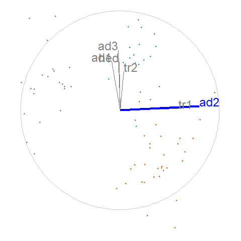

```{r setup_pres, include=FALSE,}
knitr::opts_chunk$set(
  eval      = TRUE,  # R code 
  echo      = FALSE, # code
  include   = TRUE,  # plots
  results   = 'asis', # text 'markup' 'asis' 'hold' 'hide'
  message   = F, warning = F, error = F, cache = F, cache.lazy = F,
  collapse  = TRUE,
  comment   = "",
  fig.align = "center"
  #fig.show = "hold",
  #strip.white = TRUE,
)

#options(htmltools.dir.version = FALSE)
#htmlwidgets::sizingPolicy(padding = 0, browser.fill = TRUE)
library(spinifex)
library(gganimate) 
library(ggplot2)
library(magrittr)
library(Rtsne)
library(cowplot)
```

# Research question

.large[
** Does allowing the user to steer the tour, facilitate the exploration and understanding
of the sensitivity of structure to the original variables or parameters? **
]

Research objectives:
- A) Can user controlled steering (UCS) be utilized in an environment providing non-interactive animation?
- B) What benefits does UCS provide over popular alternatives?
- C) How do we extend UCS to 3D?
- D) Does UCS with 3D displays provide perception benefits over 2D displays?

---

# Dynamic low-dimensional embeddings, tours

Linear projection of multivariate numeric data from $p$ to $d$ dimension as $p-$space is rotated, collectively known at **tours**

- Useful for identifying clusters, outliers, and structure

Shadow puppet analogy (linear projection from 3- to 2D):


---

# Tour typology

- Manual choice - **manual tour** selecting a variable and manipulation *Cook & Buja 1997*
    - Particularly useful for exploring the local structure of an interesting feature
    - R implementation via the package `spinifex`, available on [github.com/nspyrison/spinifex](https://github.com/nspyrison/spinifex)
    `devtools::install_github("nspyrison/spinifex")`

<br>
Already implemented in R package `tourr` *Wickham et al. 2011*, available on CRAN:

- Random choice - *grand tour* random forest walk in $p$-space *Asimov 1985*
- Precomputed choice - *eg.* *little tour* step through increments of all variables in order *McDonald 1982*
- Data driven - *guided tour* projection pursuit on objective function *Hurley & Buja 1990*


---

# Guided tour, flea example

.pull-left[
<br>
- Linear combination of the variables displayed on a unit circle, a *reference frame* <br><br>
- This is a *guided tour*, uses projection pursuit to maximize white space in the middle of a projection
]

.pull-right[
```{r, echo=F, out.width='90%'}
knitr::include_graphics("./images/FleaHolesTour.gif")
```
]

Created with R package `tourr` *Wickham et al. 2011*

---

# Basis and manipulation variable

**RO #A) Can user controlled steering (UCS) be utilized in an environment providing non-interactive animation?**
- Yes: *manual tour* applying *Cook & Buja 1997*, `spinifex` R package, [github.com/nspyrison/spinifex](https://github.com/nspyrison/spinifex)

.pull-left[
<br><br>
- Start from the last basis of the previous *guided tour* <br><br>
- Select a variable to manipulate: `aede2`
]

.pull-right[
```{r, results='hide', out.height='80%', out.width='80%'}
#library(spinifex)
f_dat  <- tourr::rescale(flea[,1:6])
f_cat  <- factor(flea$species)
f_path <- save_history(f_dat, guided_tour(holes()))
f_bas  <- matrix(f_path[,, max(dim(f_path)[3])], ncol=2)
f_mvar <- 5
# f_msp  <- create_manip_space(basis = f_bas, manip_var = f_mvar)
# f_proj <- data.frame(tourr::rescale(f_dat %*% f_msp[, 1:2]))

view_basis(f_bas, labels = colnames(f_dat))
```
]

---

# Manipulation space

**RO #A) Can user controlled steering (UCS) be utilized in an environment providing non-interactive animation?**

- Yes: *manual tour* applying *Cook & Buja 1997*, `spinifex` R package, [github.com/nspyrison/spinifex](https://github.com/nspyrison/spinifex)

.pull-left[
```{r, out.height='80%', out.width='80%'}
view_manip_space(basis = f_bas, manip_var = f_mvar, labels = colnames(f_dat))
```
]

.pull-right[
<br><br>
- Lay the reference frame on a table<br><br>
- Initialize a manipulation space, a means to control the contributions of the selected manipulation variable
]

---

# Rotate manipulation space

**RO #A) Can user controlled steering (UCS) be utilized in an environment providing non-interactive animation?**
- Yes: *manual tour* applying *Cook & Buja 1997*, `spinifex` R package, [github.com/nspyrison/spinifex](https://github.com/nspyrison/spinifex)

.pull-left[
<br><br>
**Algorithm,** *over a sequence of angles:*

- Project manipulation space
- Rotate the manipulation space
]

.pull-right[ 
```{r, results='hide'}
library(spinifex)
f_ang  <- .15
f_msp  <- create_manip_space(basis = f_bas, manip_var = f_mvar)
f_proj <- data.frame(tourr::rescale(f_dat %*% f_msp[, 1:2]))

### GGANIMATE
f_mt <- play_manual_tour(data = f_dat, basis = f_bas, manip_var = f_mvar,
                         angle = f_ang, axes="bottomleft", cat_var = f_cat, 
                         render_type = render_gganimate) + coord_fixed()

gganimate::anim_save(filename = "./images/f_mt.gif", animation = f_mt,
                     start_pause = 15, width = 600, height = 600, res = 300)
```
```{r, out.width='70%', out.height='70%'}

```

As an [html widget](https://nspyrison.netlify.com/thesis/flea_manualtour_mvar5/)
]

---

# UCS Application -- Hadronic collision experiments

Particle physics data, $\textbf{X} \in \mathbb{R}^{56}$, *Wang, et al. 2018*, guided tours *Cook, et al. 2018*

.pull-left[
```{r, results='hide'}
##DIS cluster, fig 8 of cook_dynamical_2018
load("./data/grDIScenter.rda")
load("./data/DIScluster_centered_basis.rda")
DIS_bas  <- DIScluster_centered_basis
DIS_dat  <- tourr::rescale(grDIScenter[, 1:6])
DIS_cat  <- factor(grDIScenter$disID)
DIS_mvar <- 6
DIS_ang  <- .15

### GGANIMATE

DIS_mt <- play_manual_tour(data = DIS_dat, basis = DIS_bas, manip_var = DIS_mvar,
                           angle = DIS_ang, axes="bottomleft", cat_var = DIS_cat,
                           render_type = render_gganimate)

gganimate::anim_save(filename = "./images/DIS_mt.gif", animation = DIS_mt,
                     start_pause = 15, width = 600, height = 600, res = 300)
```
```{r, out.width='70%', out.height='70%'}
knitr::include_graphics("./images/DIS_mt.gif")
```

As an [html widget](https://nspyrison.netlify.com/thesis/discluster_manualtour_pc6/), UCS on each of the 6 PC.
]

.pull-right[
- Summarized in 6 principal components, ~48% of the variation in the data <br>
- Starting basis from previously published figures <br><br>
- When the contribution of PC6 is full, the plain of green points extends into the line of sight <br>
- When the contribution is zeroed, the line purple points is approaching a head on view
]


---

# PCA & static linear projections

**RO #B) What benefits does UCS provide over popular alternatives?**

*Future case study*

```{r, fig.width=10.4, fig.height=4}
f_pca <- stats::prcomp(f_dat, center = TRUE, scale. = TRUE)
f_pca_bas <- as.matrix(f_pca$rotation[, 1:2])
colnames(f_pca_bas) <- c("V1", "V2")
f_pca_proj <- tourr::rescale(f_pca$x) %>% as.data.frame()

### Basis and proj
gg_f_pca_proj <-
  view_basis(f_pca_bas, labels = colnames(f_dat)) +
  geom_point(data = f_pca_proj,
             mapping = aes(x = PC1 +.75, y = PC2 -.5, color = f_cat),
             pch = as.integer(f_cat) + 15) +
  ggtitle("flea - PC1:2") + xlab("PC1") + ylab("PC2")

### Cumsum variation
f_pca_var <- as.data.frame(
  rbind(c(0,0,0,0),
    cbind("PC" = 1:6,
      "Var" = f_pca$sdev,
      "Prop_Var" = f_pca$sdev/sum(f_pca$sdev),
      "cumsum_Prop_Var" = cumsum(f_pca$sdev)/sum(f_pca$sdev),
      "var_not_explained" = 1 -  cumsum(f_pca$sdev)/sum(f_pca$sdev)
    )
  )
)

  ribbon <- f_pca_var[-1:-2, c(1,4)]
  ribbon <- ribbon[rep(row.names(ribbon), 2), ]
  ribbon[6:10, 1] <- ribbon[6:10, 1]+.999

gg_f_pca_var <-
  ggplot(f_pca_var, aes(x=PC,y=cumsum_Prop_Var,label=round(cumsum_Prop_Var, 2))) +
  geom_point(size=1) + geom_step() +
  ggtitle("Cumulative variance by PC") +
  geom_text(nudge_x=0, nudge_y=.05) +
  labs(x="Principal component", y="Cumulative variance") +
  theme_bw() +
  coord_fixed(ratio = .5) +
  geom_ribbon(data=ribbon, aes(x=PC, ymin=cumsum_Prop_Var, ymax=1),
              fill="red", alpha=.2) + theme(legend.position = 'none')

plot_grid(gg_f_pca_proj, gg_f_pca_var, align = "h", rel_widths = c(2, 1.6))
```

- Best we can do in $d$-dim static projection
- Variable transparency; map to variable space
- How much variation is lost?

---

# tSNE & non-linear projections

**RO #B) What benefits does UCS provide over popular alternatives?**

*Future case study*

```{r, results='hide', fig.width=6.1, fig.height=3.8}
f_tsne <- Rtsne(f_dat, dims = 2, perplexity=15, verbose=TRUE, max_iter = 500)
colnames(f_tsne$Y) <- paste0("tS",1:2)
f_tsne_proj <- tourr::rescale(f_tsne$Y) %>% as.data.frame()

ggplot() +
  geom_point(data = f_tsne_proj,
             mapping = aes(x = tS1, y = tS2, color = f_cat),
             pch = as.integer(f_cat) + 15) +
  theme_void()+ theme(legend.position = 'none') +
  ggtitle("flea - tSNE Components 1,2")
```

- Variables opacity; how different? in which direction? What's the relationship?
- Can suffer from overfitting
- Binary indicator of clustering/outliers

---

# 2D UCS vs alternatives -- dynamic linear

**RO #B) What benefits does UCS provide over popular alternatives?**

*Future case study*


.pull-left[
```{r, out.width='70%', out.height='70%'}

```

As an [html widget](https://nspyrison.netlify.com/thesis/flea_manualtour_mvar5/)
]

.pull-right[
<br>
- Variable transparency; map to variable space
- Subsets of variation viewed as projection changes
]

---

# 2D vs 3D low-dimensional embeddings

```{r, out.width='50%', out.height='50%'}
knitr::include_graphics("./images/nelson98fig.PNG")
```

- 2D tours: head tracked VR vs standard monitor
- VR: ++ cluster identification, + structure, tie dimensionality, - bushing speed

*Nelson et al. 1998*

---

# 2D vs 3D low-dimensional embeddings

```{r, out.width='100%', out.height='100%'}
knitr::include_graphics("./images/gracia16fig.PNG")
```

- 2D and 3D scatterplots of PCA on standard monitor
- 3D: + point distances, + identify outliers, slower in both

*Gracia et al. 2016*

---

# 2D vs 3D low-dimensional embeddings

```{r, out.width='30%', out.height='30%'}
knitr::include_graphics("./images/wagner18fig.PNG")
```

- 2D and 3D scatterplots of PCA on standard monitor and head mounted VR
- head-mounted VR: more accuracy, easier to navigate, less comfortable

*Wagner et al. 2018*

---

# Extending UCS to 3D

**RO #C) How do we extend UCS to 3D?**

*future exploratory design*

`spinifex` and Immersive Analytics Tool Kit, `IATK`, *Cordeil 2019*

.pull-left[
```{r, out.width='70%', out.height='70%'}
knitr::include_graphics("./images/DIS_mt.gif")
```
]

.pull-right[
```{r, out.width='70%', out.height='70%'}
knitr::include_graphics("./images/IATK.png")
```
]

---

# Low-dimension embeddings across display type

**RO #D) Does UCS with 3D displays provide perception benefits over 2D displays?**

*future empirical study*

**Design space:**
- Display type: 2D monitor, 3D monitor, head-mount, physical immersion
- Task type: structure, UCS, clustering, dimensionality, outliers
- Measures: accuracy, speed, subjective measures (Likert scale), demographic information, cross-departmental comparison(?)

---

# Research question - Recap

** Does allowing the user to steer the tour, facilitate the exploration and understanding
of the sensitivity of structure to the original variables or parameters? **

- A) Can user controlled steering (UCS) be utilized in an environment providing non-interactive animation?
    - `spinifex` in R
- B) What benefits does UCS provide over popular alternatives?
    - case study: static linear vs static non-linear vs dynamic linear
- C) How do we extend UCS to 3D?
    - experimental design: `spinifex` and `IATK`
- D) Does UCS with 3D displays provide perception benefits over 2D displays?
    - empirical study: dynamic linear embedding across display type

---

### Research timeline

```{r timeline, echo=F, fig.height=8, fig.width=14}
#out.extra='angle=90
## working from: https://stats.andrewheiss.com/misc/gantt.html
library(tidyverse)
library(lubridate)
library(scales)

tasks <- tribble(
  ~Start,       ~End,         ~Project,     ~Task,
  "2018-04-01", "2019-06-01", "UCS in 2D",  "RO: A) spinifex package, 2D UCS",
  "2018-04-01", "2019-02-01", "UCS in 2D",  "spinifex code",
  "2018-12-01", "2019-03-01", "UCS in 2D",  "spinifex paper",
  "2019-03-01", "2019-06-01", "UCS in 2D",  "spinifex Submission (R Journal)",
  "2019-01-01", "2019-03-01", "Milestones", "Candidature confirmation",

  "2019-03-01", "2019-12-01", "UCS in 3D",  "RO: C) Tours, UCS in 3D",
  "2019-03-01", "2019-08-01", "UCS in 3D",  "UCS to IATK, C# code",
  "2019-06-01", "2019-09-01", "UCS in 3D",  "UCS in 3D paper",
  "2019-09-01", "2019-12-01", "UCS in 3D",  "UCS in 3D Submission (VAST)",
  "2020-01-01", "2020-03-01", "Milestones", "Mid candidature review",

  "2019-10-01", "2020-09-01", "UCS 2D vs 3D", "RO: D) UCS across disp type, 2D vs 3D",
  "2019-10-01", "2020-02-01", "UCS 2D vs 3D", "2D vs 3D C# code",
  "2020-01-01", "2020-04-01", "UCS 2D vs 3D", "2D vs 3D Experimental survey",
  "2020-03-01", "2020-06-01", "UCS 2D vs 3D", "2D vs 3D paper",
  "2020-06-01", "2020-09-01", "UCS 2D vs 3D", "2D vs 3D Submission (CHI)",

  "2020-04-01", "2020-12-01", "UCS Benefits", "RO: B) UCS Benefits over alternatives",
  "2020-04-01", "2020-08-01", "UCS Benefits", "UCS Benefits C# code and comparison",
  "2020-06-01", "2020-09-01", "UCS Benefits", "UCS Benefits paper",
  "2020-09-01", "2020-12-01", "UCS Benefits", "UCS Benefits Submission (VAST)",

  "2020-11-01", "2021-03-01", "Milestones", "pre-submission presentation",
  "2021-01-01", "2021-04-01", "Milestones", "thesis completion and submission"
)

# Convert data to long for ggplot
tasks.long <- tasks %>%
  mutate(Start = ymd(Start),
         End = ymd(End)) %>%
  gather(date.type, task.date, -c(Project, Task)) %>%
  #arrange(date.type, task.date) %>%
  mutate(Task = factor(Task, levels=rev(unique(Task)), ordered=T))
# Custom theme for making a clean Gantt chart
theme_gantt <- function(base_size=11) {
  ret <- theme_bw(base_size) %+replace%
    theme(panel.background = element_rect(fill="#ffffff", colour=NA),
          axis.title.x=element_text(vjust=-0.2), axis.title.y=element_text(vjust=1.5),
          title=element_text(vjust=1.2),
          panel.border = element_blank(), axis.line=element_blank(),
          panel.grid.minor=element_blank(),
          panel.grid.major.y = element_blank(),
          panel.grid.major.x = element_line(size=0.5, colour="grey80"),
          axis.ticks=element_blank(),
          legend.position="bottom",
          axis.title=element_text(size=rel(0.8)),
          strip.text=element_text(size=rel(1)),
          strip.background=element_rect(fill="#ffffff", colour=NA),
          panel.spacing.y=unit(1.5, "lines"),
          legend.key = element_blank())

  ret
}

# Calculate where to put the dotted lines that show up every three entries
x.breaks <- seq(length(tasks$Task) + 0.5 - 3, 0, by=-3)

# Build plot
timeline <- ggplot(tasks.long, aes(x=Task, y=task.date, colour=Project)) +
  geom_line(size=6) +
  geom_vline(xintercept=x.breaks, colour="grey80", linetype="dotted") +
  guides(colour=guide_legend(title=NULL)) +
  labs(x=NULL, y=NULL) + coord_flip() +
  scale_y_date(date_breaks="2 months", labels=date_format("%b ‘%y")) +
  theme_gantt() + theme(axis.text.x=element_text(angle=45, hjust=1)) +
  scale_color_brewer(palette = "Dark2") +
  theme(axis.text.x = element_text(size = 16),
        axis.text.y = element_text(size = 16),
        legend.text = element_text(size = 16))

timeline
```

---

# Milestone documents

- FIT 5144 hours
    - \>120 hours **Tracked, awaiting mandatory events**, due at mid-candidature review
- WES Academic record
    - FIT6021: 2018 S2, **Completed** with Distinction
    - FIT5144: 2019 S1+2, **Upcoming**, due at mid-candidature review
    - FIT5113: 2018 S2, **Exemption submitted**, forwarded 14/02/2019
- myDevelopment - IT: Monash Doctoral Program - Compulsory Module
    - Monash Graduate Research Student Induction: **Completed**
    - Research Integrity - Choose the Option most relevant: **Completed** (2 required of 4)
    - Faculty Induction: **Content unavailable** (9/02/2019: "Currently being updated and will be visible in this section soon")

---
class: center, middle

# Thanks!

Slides created in R using rmarkdown and xaringan

Slides -- [github.com/nspyrison/talk_confirmation2019]( https://github.com/nspyrison/talk_confirmation2019)
<br><br><br><br>

.left[
*R Core Team, 2018*

*Xie et al. 2018*

*Xie, 2018*
]

---

# References (1/2)

*In order of appearance:*

Cook, D., & Buja, A. (1997). Manual Controls for High-Dimensional Data Projections. Journal of Computational and Graphical Statistics, 6(4), 464–480. https://doi.org/10.2307/1390747

Wickham, H., Cook, D., Hofmann, H., & Buja, A. (2011). tourr : An R Package for Exploring Multivariate Data with Projections. Journal of Statistical Software, 40(2). https://doi.org/10.18637/jss.v040.i02

Asimov, D. (1985). The grand tour: a tool for viewing multidimensional data. SIAM Journal on Scientific and Statistical Computing, 6(1), 128–143.

McDonald, J. A. (1982). INTERACTIVE GRAPHICS FOR DATA ANALYSIS.

Hurley, C., & Buja, A. (1990). Analyzing High-Dimensional Data with Motion Graphics. SIAM Journal on Scientific and Statistical Computing, 11(6), 1193–1211. https://doi.org/10.1137/0911068

Wang, B.-T., Hobbs, T. J., Doyle, S., Gao, J., Hou, T.-J., Nadolsky, P. M., & Olness, F. I. (2018). Visualizing the sensitivity of hadronic experiments to nucleon structure. ArXiv Preprint ArXiv:1803.02777.

Cook, D., Laa, U., & Valencia, G. (2018). Dynamical projections for the visualization of PDFSense data. Eur. Phys. J. C, 78(9), 742.


---

# References (2/2)

Nelson, L., Cook, D., & Cruz-Neira, C. (1998). XGobi vs the C2: Results of an Experiment Comparing Data Visualization in a 3-D Immer- sive Virtual Reality Environment with a 2-D Workstation Display. Computational Statistics, 14(1), 39–52.

Gracia, A., González, S., Robles, V., Menasalvas, E., & von Landesberger, T. (2016). New insights into the suitability of the third dimension for visualizing multivariate/multidimensional data: A study based on loss of quality quantification. Information Visualization, 15(1), 3–30. https://doi.org/10.1177/1473871614556393

Wagner Filho, J., Rey, M., Freitas, C., & Nedel, L. (2018). Immersive Visualization of Abstract Information: An Evaluation on Dimensionally-Reduced Data Scatterplots.

Cordeil, M. (2019). Immersive Analytics Toolkit (Version IATK 1.0 (Mala) Unity 2017). Retrieved from https://github.com/MaximeCordeil/IATK (Original work published 2017)

R Core Team. (2018). R: A Language and Environment for Statistical Computing. Vienna, Austria: R Foundation for Statistical Computing. Retrieved from https://www.R-project.org/

Xie, Y., Allaire, J. J., & Grolemund, G. (2018). R Markdown: The Definitive Guide. Boca Raton, Florida: Chapman and Hall/CRC. Retrieved from https://bookdown.org/yihui/rmarkdown

Xie, Y. (2018). xaringan: Presentation Ninja. Retrieved from https://CRAN.R-project.org/package=xaringan


<!-- --- -->

<!-- # Appendix (1/2) -->

<!-- `tourr::animate_groupxy()` -->

<!-- ```{r, results="hold", out.width = "50%"} -->
<!-- knitr::include_graphics("./images/FleaHolesTour_groupxy.gif") -->
<!-- ``` -->

<!-- available on github: `devtools::install_github("nspyrion/tourr")` -->

<!-- --- -->

<!-- # Appendix (2/2) -->

<!-- `tourr::animate_density2d()` -->

<!-- ```{r, results="hold", out.width = "50%"} -->
<!-- knitr::include_graphics("./images/FleaHolesTour_density2d.gif") -->
<!-- ``` -->

<!-- available on github: `devtools::install_github("nspyrion/tourr")` -->
